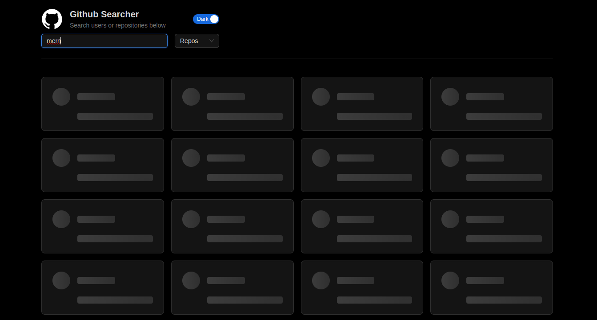

# Github Searcher App

## Overview

Github Searcher App enables users to look up Github users or repositories using specific search criteria. Users have the option to narrow down their search results by selecting particular categories like "users" or "repositories".

## Tools

The user interface for the app was built in React.js with TypeScript and Ant Design. The program manages the search query, search category, and search results using Redux-toolkit and Redux-persist. Based on user searches, the app communicates with the Github API to retrieve search results.

## Features

- **Search**: Users can utilize the input area to type a search keyword to find Github users or repositories. To prevent making too many API requests while the user is typing, the search is immediately initiated with a debounce effect.

- **Category Filter**: Users can choose a category to filter their search results, such as "users" or "repositories". The chosen category will affect how the search results are updated.

- **Infinite Scroll**: The app uses infinite scroll to load more search results as the user scrolls down the page.

- **Loading Feedback**: To ensure a seamless and responsive user experience, the app gives loading feedback to users during API requests and pagination.

## Decisions and Reasons

1. **Debouncing for Search**: The app employs a debouncing approach to prevent making API calls for each keypress. This indicates that the search is not initiated until the user has stopped typing for the predetermined amount of time (in this case, 1000ms). This enhances the performance of the application and cuts down on pointless API calls.

2. **State Management with Redux Toolkit**: Redux toolkit centralizes the app's state with less boilerplate code and makes data from various components easily accessible. Additionally, it makes it possible for asynchronous events like API queries and loading feedback to be handled effectively via thunk middleware.

3. **Infinite Scroll**: The app leverages infinite scroll to load additional search results as the user scrolls down the page rather than displaying a "Load More" button. This reduces the need for further user involvement and offers a more seamless user experience.

4. **Design tokens**: The UI components in the app are created using the Ant Design library. Usage of design tokens allows for a consistent and adaptable design system.

5. **Error Handling**: The app has error handling so that when an API request fails, error messages are sent to users. The Ant Design 'Alert' component is used to display error alerts.

6. **Code Organization**: The code of the application is organized into distinct components, hooks, and slices. This modular approach enhances the readability and maintainability of the code.

7. **Custom Hooks**: To handle particular functions in a reusable way, custom hooks such as `useDebounce` and `useInfiniteScroll` have been implemented. As a result, code duplication is decreased and code reuse is encouraged.

8. **CSS-in-JS**: To reduce the styles to component level rather than having global styles. Allows for dynamic styling with ant-design and overall a better developer experience.

## Getting Started

To run the app locally, follow these steps:

1. Clone the repository to your local machine.
2. Navigate to the project directory and install dependencies with `npm install`.
3. Obtain a Github Search API token.
4. Create a `.env` file in the root of the project and add your API token as `GITHUB_ACCESS_TOKEN`.
5. Start the development server with `npm run dev`.
6. Open your web browser and go to `http://localhost:5173` to access the app.

## Credits

The Github Searcher app was created by Hassam Ud Din as part of the front-end training at [Carbonteq](https://www.carbonteq.com/). More information about the training roadmap on their [Dev Portal](https://dev-portal.carbonteq.com/docs/Training/react/githubsearch).
